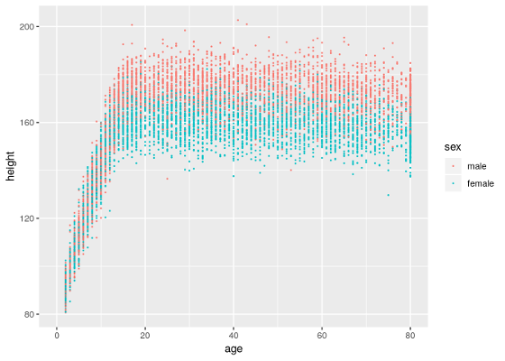

### Vorlesung "Einführung Data Science für Biologen"

## Hinweise zur Klausur-Vorbereitung

Liebe Studierende

sicher haben Sie bereits damit begonnen, sich auf die Klausur für unsere Data-Science-/Bioinformatik-Vorlesung vorzubereiten. Mir ist klar, dass das nicht ganz einfach ist, da die Vorlesung neu ist und SIe somit wenig Anhaltspunkte haben, wie so eine Klausur aussehen könnte, und zugegebenermaßen war ich mir da anfangs auch recht unsicher. 

Daher habe ich Ihnen im folgenden zunächst eine Liste aller Themen, die wir behandelt haben, zusammen gestellt, um den Stoff grob einzugrenzen, und dann ein paar Beispiel-Aufgaben ausformuliert.

Ich hoffe, das hilft Ihnen bei der Vorbereitung.

### Inhaltsübersicht

Im Folgenden habe ich eine Übersuch zusammen gestellt über die Themen, die wir in diesem Semester besprochen haben. Sie können dies als Hilfe verwenden, um zu sehen, ob Sie sich bei jedem dieser Themen in ein paar Sätzen erklären können, wie das jeweils geht.

- Arbeiten mit Tabellen in R/Tidyverse
	- Laden von Daten in Tabellen-/Matrix-Form ("read_tsv" etc)
	- Zusammenfügen von Tabellen ("left_join" und "inner_join")
	- Ändern und Hinzufügen von Spalten mit Berechnungen ("mutate")
	- Auswählen und Filtern von Zeilen ("filter")
	- Aufteilen in Gruppen ("group_by")
	- Berechnen von Statistiken pro Gruppe ("summerize")
	- breite und lange Tabellen ("spread" und "gather")

- Visualisieren von Daten mit Scatter-Plots
	- einfache Scatter-Plots ("ggplot" mit "geom_point")
	- zusätzliche Information durch Verwendung von Farben u.ä. ("aes")
	- Achsentransformation (z.B. logarithmische Achsen) ("scale_x_log10" u.ä.)
	- Facetting: separate Plots für Untergruppen der Daten ("facet_wrap")

- Andere Plots:
	- Histogramme und Dichte-Kurven ("geom_hist", "geom_density")
	- Spezialplots, z.B. Bänder ("geom_ribbon")
	- Heatmaps ("pheatmap")

- Inferenzielle Statistik:
	- Unsicherheit eines Schätzers (z.B. eines Mittelwerts)
	- Standardfehler eines Mittelwerts
	- Zentraler Grenzwertsatz und Normalverteilung
	- Vergleichende Statistiken (zB Differenz von Mittelwerten)
	- Permutations-Nullverteilungen
	- t-Test als Beispiel eines parametrischen Tests
	- p-Wert: Definition, Bedeutung, Berechnung durch Tests
	- multiples Testen
	- False Discovery Rate (FDR) und Benjamini-Hochberg-Korrektur

- RNA-Seq
	- Präprozessierung: von Sequenzier-Reads zu Count-Matrizen
	- Differentielle Gen-Expression
	- p-Werte und FDR bei Omics-Daten
	- Daten-Visualisierung: MA-Plots
	- und Gen-spezifische Plots

- Gene Set Enrichment Analysis
	- Konzept: wozu ist das gut?
	- Sammlungen von Gen-Sets (GO, MSigDb, etc)
	- Analyse mit Fisher-Tests
	- oder mit KS-Statistik
	- Interpretation der Ergebnisse

- Distanzmaße und Clustering
	- Korrelationskoeffizient als Beispiel eines Distanzmaßes
	- Bedeutung von Homoskedastizität
	- Transformationen zur Varianzstabilisierung
	- Distanz-Matrizen
	- Hierarchisches Clustering
	- Visualisierung durch Heatmaps
	- Interpretation von Dendrogrammen und Heatmaps

- RNA-Seq-Analyse mit DESeq2 o.ä.
	- Shrinkage-Estimation von Varianz und Log-fold-Change
	- Behandlung von zusätzlichen Kovariaten (zB Geschlecht, gepaarte Proben) mit ANOVA

### Beispielaufgaben

#### Eine Aufgabe zum Tidyverse

Sicherlich werde ich Aufgaben zu R/Tidyverse stellen. Für volle Punktzahl sollten Sie natürlich den korrekten R-Code angeben können, der das Problem löst. Sie werden aber auch Punkte bekommen, wenn Sie zumindest konzeptionell angeben können, wie die Tabellen umgeformt werden sollten, und welche R-Funktionen dazu verwendet werden können.

Hier sind, zum Beispiel, Aufgaben, die die ersten beiden Vorlesungen zu Fragen umformulieren:

In liegen Daten aus einer Gesundheits-Studie vor, bei der zufällig ausgeählte Personen untersucht werden.

(a) Ihnen liegen zwei Tabellen vor, die dieselben Personen beschreiben. Beide Tabellen haben Sie bereits in R als Tidyverse-"Tibbles" geladen. Die erste Tabelle, mit R-Variablennamen "demogr" (kurz für "demographische Daten"), enthält Spalten für "sex", "age", "country_of_birth" und noch einige weitere, die andere Tabelle heisst "bmeas" (für "body measurement", d.h. "Körpermaße") enthält die Spalten "height" (Körpergröße in cm), "weight" (Gewicht in kg) und "waist" (Bauchumfang auf Höhe des Nabels in cm). Ausserdem enthalten beide Tabellen eine Spalte "subject_id" mit Identifikations-Nummern, die die Probanden eindeutig aber anonymisiert identifiziert, so dass man zu einer Zeile in einer der Tabellen die zugehörige Zeile in der anderen Tabelle daran erkennen kann, dass die Subject-IDs gleich sind. 

  Sie möchten die durchschnittliche Körpergröße für alle Frauen und für alle Männer berechnen. Dazu benötigen Sie eine Tabelle. in der Sie für jeden Probanden jeweils Geschlecht und Körpergröße haben. Leider liegen diese Information aber auf die beiden Tabellen verteilt vor. 

  - Mit welchem Tidyverse-Befehl können sie die beiden Tabellen zu einer zusammen fassen, und die neue Tabelle in einer Variable mit Namen "big_table" ablegen? Geben Sie den R-Code an, der aus den beiden Tabellen die zusammengefasste Tabelle "full_table" mit allen Spalten erzeugt. 

  - Macht es beim Zusammenfassen der Tabellen etwas aus, wenn die Zeilen für die Probanden in den Tabellen nicht in derselben Reihenfolge vorliegen?
 
   - Zusatzfrage: Nehmen Sie an, einige Probanden fehlten in der zweiten Tabelle? Was geschieht mit diesen in der zusammengefügten Tabelle?

(b) Hier ist ein Scatter-Plot, der die Körpergröße gegen das Lebensalter aufträgt, und die Geschlechter farblich unterscheidet. Geben Sie den R-Code an, mit dem Sie diesen Plot aus der eben erstellten "big_table" erzeugen können.

(c) Um in der nun folgenden Analyse nur die Körpergrößen erwachsener Menschen eingehen zu lassen, möchten Sie alle Probanden aus der "big_table" entfernen, die noch nicht 18 Jahre alt sind. Welchen R-Code könnten Sie dazu anwenden?

##### Lösung

Versuchen Sie, die Aufgabe auf Ihrem Computer mit R zu lösen. Wenn Sie nicht weiter kommen, spicken Sie im Material zu den ersten beiden Vorlesungen. Da ist sämtlicher Code zu finden.

#### Eine Aufgabe zur Datenvisualisierung

Sehen Sie sich auch nochmal an, welche Plots wir zu welchen Zwecken ertsellt haben, und wie diese Aussehen. Vielleicht bitte ich Sie, einen PLot zu skizzieren.

Beispiel-Aufgabe: 

Sie möchten zwei Histogramm der Körpergrößen von Erwachsenen erzeugen, eines für Männer und eines für Frauen.

- Zeichnen Sie die Histogramme, wie Sie aussehen könnten. Um zu wissen, was typische Körpergrößen für Männer und Frauen sind, verwenden Sie folgende ungefähren Daten: Der durschnittliche Mann (in Deutschland) is 1,69 m groß, die durchschnittliche Frau 1,67 m. Die Standardabweichungen sind in beiden Fällen etwa 7 cm.

- Geben Sie den R-Code an, der aus der "big_table" diese Histogramme erzeugt.

#### Konzeptionelle Aufgaben

Natürlich werde ich nicht nur nach R-Code fragen. Wir haben auch viele Konzepte besprochen, die man abfgaren könnte.

Hier ein Beispiel, dass sich auf die letzte Vorlesung bezieht:

Sie haben Gewebeproben von 10 Patienten mit eine bestimmten Hautkrankheit und von 10 gesunden Kontroll-Personen. Unter den Patienten finden sich 7 Männer und 3 Frauen, unter den gesunden Vergleichs-Personen 4 Männer und 6 Frauen. Sie führen eine RNA-Seq-Analyse durch und suchen Gene, deren Expression im Durchschnitt über alle Patienten signifikant höher ist als im  Durchschnitt über all Gesunden. Ihnen fällt auf, dass viele dieser Gene auf dem Y-Chromosom liegen.

-  Dürfen Sie daraus folgern, dass die Krankheit etwas mit dem Y-Chromosom zu tun hat? Wenn nein, was ist dann der Grund für den beobachteten Effekt?

- Wie könnten Sie das Problem, das hier vorliegt, beheben, ohne die Studie wiederholen zu müssen?

#### Wissensfragen

Ich hoffe, Sie haben sich auch ein paar Fakten gemerkt, damit ich auch einige Wissensfragen stellen kann.

Beispiel: Wie lautet die genaue Definition des "p-Werts"? Warum muss man für "multiple Testen" korrigieren, wenn man, z.B., viele Gene auf differentielle Expression testet, und welche Größe haben Benjamini und Hochberg vorgeschlagen, hier zu ermitteln? 

### Noch Fragen?

Ich bin zur Zeit auf Reisen, lese aber meine E-Mails, und werde versuchen, zu antworten. Damit alle die gleichen Informationen habe, werde ich Antworten und Klarstellungen hier unten anfügen. Werfen Sie also gelegentlich einen Blick auf das Ende dieser Seite, ob es etwas Neues gibt.

Die Tutoren helfen Ihnen sicher auch gerne, falls Sie mit einer Frage im 5. Stock vorbei kommen.

