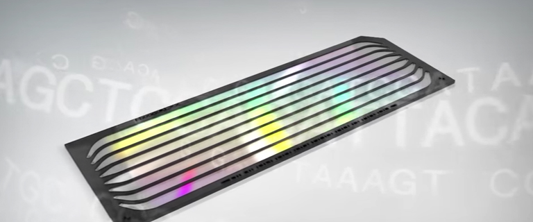
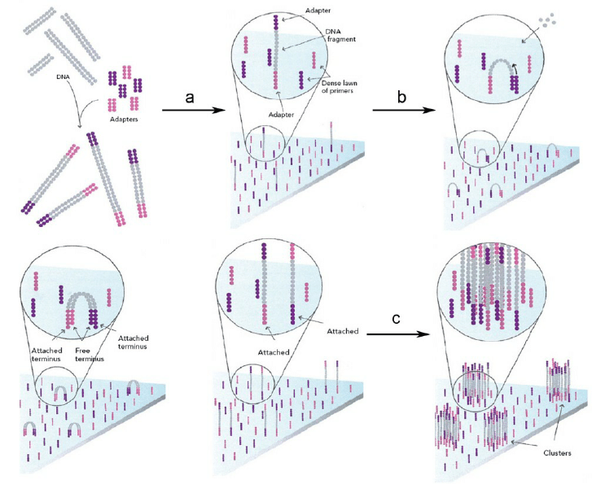
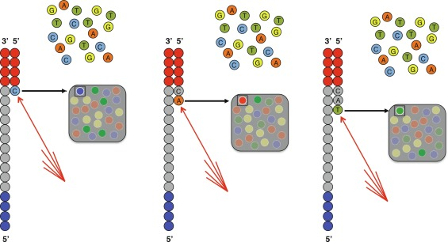
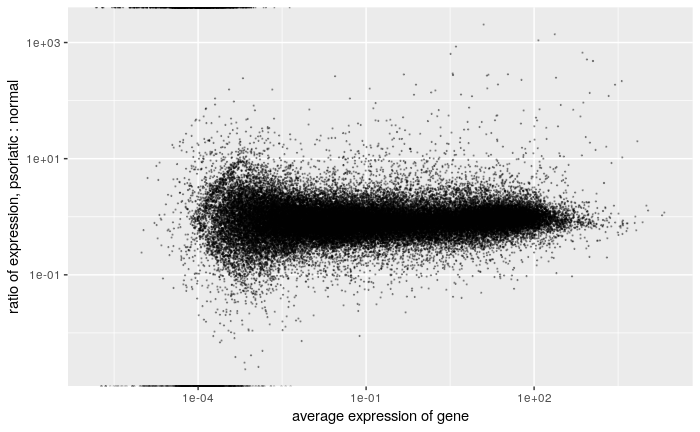
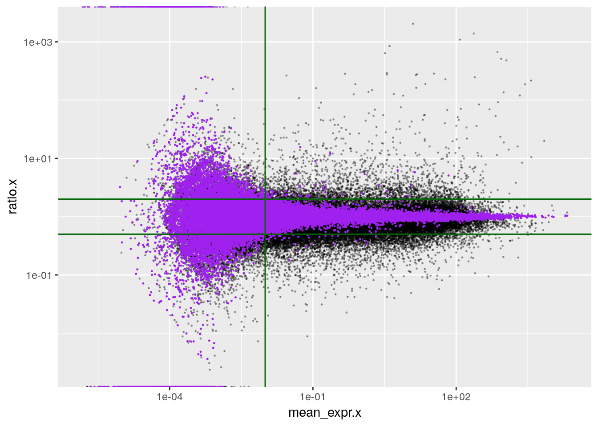

# 4. Vorlesung

#### [blank space]

```


```

## Übungen

Wie die Übungen laufen sollten:

- Sie versuchen die Hausaufgaben zuhause.
- Bei Problemen fragen Sie im Forum.
- Während der Übung führt der Tutor die Lösung Schritt für Schritt vor.
- Sie versuchen jeden Schritt auf Ihrem Laptop.
- Der Tutor wartet, bis allen der Schritt gelungen ist, und hilft, wenn es hakt.
- Dann wird diskutiert, was der Befehl genau macht.
- Jeder versucht, den Befehl abzuwandeln, um zu sehen, was geschieht.
- Erst wenn alle den Befehl verstanden haben, geht der Tutor zum nächsten Schritt.

## RNA-Seq

Analyse von RNA-Seq-Daten ist eine Standard-Aufgabe in der Bioinformatik.

Wir sehen uns das daher recht genau an.


## RNA-Seq: Übersicht

- Extrahierere und amplifiziere alle mRNA in einer Probe
- Sequenziere die RNA
- Identifiziere die Gene, von der die Sequenzen kommen
- Zähle, wie viele Sequenzen (Reads) von jedem Gen kommen
- Find Gene, die in den Sample-Gruppen verschieden stark exprimiert sind


## RNA-Seq: Vorgehen / Labor

Illumina-Verfahren:

- Löse die Zellmembranen auf
- Ziehe die mRNA mittels magnetischer Beads mit polyT-Oligos heraus
- Fragmentiere die mRNA mit Ultraschall 
- Wandle die mRNA mittels Reverser Transkriptase in cDNA um
- PCR-Amplifiziere die cDNA
- Lade die cDNA in die Flow-cell
- Führe Bridge-PCR in der Flow cell durch
- Sequenziere die DNA in der Flow cell mit Sequencing-by-Synthesis 


## Bridge PCR und Sequencing-by-Synthesis

https://en.wikipedia.org/wiki/Illumina_dye_sequencing

Flow cell:



Bridge PCR:



Sequencing by synthesis




## RNA-Seq: Vorgehen / Bioinformatik 

Präprozessierung

- Startpunkt: Datei mit gelesenen Sequenzen ("Reads") vom Sequencer
- Suche für jede Sequenz, wo sie im Genom vorkommt ("Alignment")
- Zähle für jedes Gen, wie viele Reads auf dieses Gen gefallen sind

Führe all dies für jede Probe durch

Ergebnis: Eine Matrix

- mit einer Spalte für jede Probe
- einer Zeile für jedes Gen
- Zahlen, die angeben, wie viele Reads in der Probe auf das Gen gefallen sind


## FASTQ-Datei

So kommen die Daten aus dem Sequenzierer:

```
@SRR001666.1 071112_SLXA-EAS1_s_7:5:1:817:345 length=72
GGGTGATGGCCGCTGCCGATGGCGTCAAATCCCACCAAGTTACCCTTAACAACTTAAGGGTTTTCAAATAGA
+SRR001666.1 071112_SLXA-EAS1_s_7:5:1:817:345 length=72
IIIIIIIIIIIIIIIIIIIIIIIIIIIIII9IG9ICIIIIIIIIIIIIIIIIIIIIDIIIIIII>IIIIII/
@SRR001666.2 071112_SLXA-EAS1_s_7:5:1:801:338 length=72
GTTCAGGGATACGACGTTTGTATTTTAAGAATCTGAAGCAGAAGTCGATGATAATACGCGTCGTTTTATCAT
+SRR001666.2 071112_SLXA-EAS1_s_7:5:1:801:338 length=72
IIIIIIIIIIIIIIIIIIIIIIIIIIIIIIII6IBIIIIIIIIIIIIIIIIIIIIIIIGII>IIIII-I)8I
```

Jeder Read hat 4 Zeilen:
- '@', gefolgt vom Namen (ID) des Reads
- die gelesene DNA-Sequenz
- '+', evtl. gefolgt nochmals vom Namen
- der "Quality string", der kodiert anzeigt, wie klar das Signal bei der Sequenzierung war


## Typische Reads

- mRNA wird meist auf 300 bis 500 base pairs (bp) fragmentiert
- von der so entstandenden cDNA liest der Sequenzierer 50, 75, 100, oder 150 bp
  vom 5'-Ende aus
- falls gewünscht, kann auch noch vom 3'-Ende aus gelesen werden ("paired end sequencing")
- die Mitte kann nicht gelesen werden


## Anzahl Reads, Multiplexing

- Eine Flow-cell hat 8 Lanes, die getrennt befüllt werden können
- Jede Lane produziert bis to 250 Millionen Reads
- Um in einer Lane mehrere Proben zu mischen, kann man Multiplex-Tags verwenden


## Alignment: Referenz-Genom

- Für die meisten Modellorganismen ist ein Referenz-Genom verfügbar, z.B. auf https://www.ensembl.org/info/data/ftp/index.html
- Für den Menschen beginnt die Datei "Homo_sapiens.GRCh38.dna.toplevel.fa.gz" so

```
>1 dna:chromosome chromosome:GRCh38:1:1:248956422:1 REF
NNNNNNNNNNNNNNNNNNNNNNNNNNNNNNNNNNNNNNNNNNNNNNNNNNNNNNNNNNNN
NNNNNNNNNNNNNNNNNNNNNNNNNNNNNNNNNNNNNNNNNNNNNNNNNNNNNNNNNNNN
NNNNNNNNNNNNNNNNNNNNNNNNNNNNNNNNNNNNNNNNNNNNNNNNNNNNNNNNNNNN
[...]
GCTGAGGCAGGAGAATCGCTTGAATCCGGGAGGCGGAGGTTGCAGTGAGACAAGATCATG
CCACCACACTCCAGTCTGGGTGACAGAGCGAGACCCTGTCTCAAAAAAAAAAAAAAAGGC
CGGGCTCAGTGGCTCACGCCCAGTAATCCCAGCACTTTGGGAGGCCGAGGCGGGTGGATC
ACGAGGTCAGGAGATCTAGACCATCCTGGCTAACACGGTGAAACCCCGTCTCTACTAAAA
ATACAAAAAAAATAGCCAGGCATTGTAGCGGGCACCTGTAGTCCCAGCTACTCGGGAGGC
TGAGGCAGAAGAATGGCGTGAACCCAGAAGGCGGAGCTTGCAGTGATCCGAGATGCCGCC
ACTGCACTCCAGCCTGGGGGACAGAGCGAGACTCCGTCTAAAAAAAAAAAAATTAAATCA
CATGTAATTGTCTGTTTGGGCCCCCACTGATCACCACTTCTAAGGGGGGGCTCTTCTCTG
GAACAACCGTGTATAGGTCCCCATTCCCACGGCAATGCTTTGAGGGGCTTTTTGCCTGGG
CTCTGGCTGCTCCCTGGCCCCTCCACTCAGCGACTTCCCTCCCCTCCCCTCTCGGCTCCA
GCACATCATCTTCTGTTTGGGCTTTTCCTCCGGTTGCTCCCTCCATGTTCCCCCCCGCCT
TTTCTCCCAACACCAGCTCCCACTTCCCCTTCCTTAGTGGAGTAGGTAAGAGCAGACCGC
CTGGTTTCAAGTCCTGGCCGTGCCATTTCCTAGCATCTAGCAGTGAGAACTTGGGCAAGT
TCTTCCCTTCTCAATGCCTCAATTTCCTCAACTGTAAAAGGGGAATACTAGCAGTTCCTA
GCTCACAGGGTTGTTTGAGGATGGAAAGGTATTAAAAAGCCTTACGGGGCCTTAGCTCTT
TAATTTGGCTTGTAGTAAGCACACAAAAGTGGTTATTATTATTATATTATTTTAGAGATA
GGGATGATTTTAGAATGCAGTAGCACGATCATTGTGCGCTACAGTTTCAAACTCCTGGGC
[...]
>2 dna:chromosome chromosome:GRCh38:1:1:248956422:1 REF
```

- Wir haben Sequenzen für alle 22 Autosomen, die beiden Sex-Chromosomen X und Y, die mitochondriale DNA ("MT") und einige sog. "nicht-chromosomale Contigs".

- In den Chromosomen fehlt Sequenz an den Enden (Telomere) und teils in der Mitte (Zentromer).

- Das Referenz-Genom wird alle paar Jahre überarbeitet. Dies hier ist das Assembly "GRCh38", d.h. Version 38 des *h*umanen Referenz-Genoms, herausgegeben vom Genome Reference Consortium (GRC) im Dezember 2013. 


## Alignment: Gen-Modelle

Wir müssen auch wissen, wo in diesen langen Sequenzen die Gene liegen.

Im EnsEMBL-Gen-Browser können wir uns das ansehen: https://www.ensembl.org/Homo_sapiens/Location/View?r=17:63992802-64038237

Die Koordinaten können wir auch herunterladen, zB als GTF-Datei. 

```
#!genome-date 2013-12
#!genome-build-accession NCBI:GCA_000001405.28
#!genebuild-last-updated 2019-06
1       havana  gene    11869   14409   .       +       .       gene_id "ENSG00000223972"; gene_version "5"; gene_name "DDX11L1"; gene_source "havana"; gene_biotype "transcribed_unprocessed_pseudogene";
1       havana  transcript      11869   14409   .       +       .       gene_id "ENSG00000223972"; gene_version "5"; transcript_id "ENST00000456328"; transcript_version "2"; gene_name "DDX11L1"; gene_source "havana"; gene_biotype "transcribed_unprocessed_pseudogene"; transcript_name "DDX11L1-202"; transcript_source "havana"; transcript_biotype "lncRNA"; tag "basic"; transcript_support_level "1";
1       havana  exon    11869   12227   .       +       .       gene_id "ENSG00000223972"; gene_version "5"; transcript_id "ENST00000456328"; transcript_version "2"; exon_number "1"; gene_name "DDX11L1"; gene_source "havana"; gene_biotype "transcribed_unprocessed_pseudogene"; transcript_name "DDX11L1-202"; transcript_source "havana"; transcript_biotype "lncRNA"; exon_id "ENSE00002234944"; exon_version "1"; tag "basic"; transcript_support_level "1";
1       havana  exon    12613   12721   .       +       .       gene_id "ENSG00000223972"; gene_version "5"; transcript_id "ENST00000456328"; transcript_version "2"; exon_number "2"; gene_name "DDX11L1"; gene_source "havana"; gene_biotype "transcribed_unprocessed_pseudogene"; transcript_name "DDX11L1-202"; transcript_source "havana"; transcript_biotype "lncRNA"; exon_id "ENSE00003582793"; exon_version "1"; tag "basic"; transcript_support_level "1";
1       havana  exon    13221   14409   .       +       .       gene_id "ENSG00000223972"; gene_version "5"; transcript_id "ENST00000456328"; transcript_version "2"; exon_number "3"; gene_name "DDX11L1"; gene_source "havana"; gene_biotype "transcribed_unprocessed_pseudogene"; transcript_name "DDX11L1-202"; transcript_source "havana"; transcript_biotype "lncRNA"; exon_id "ENSE00002312635"; exon_version "1"; tag "basic"; transcript_support_level "1";
1       havana  transcript      12010   13670   .       +       .       gene_id "ENSG00000223972"; gene_version "5"; transcript_id "ENST00000450305"; transcript_version "2"; gene_name "DDX11L1"; gene_source "havana"; gene_biotype "transcribed_unprocessed_pseudogene"; transcript_name "DDX11L1-201"; transcript_source "havana"; transcript_biotype "transcribed_unprocessed_pseudogene"; tag "basic"; transcript_support_level "NA";
1       havana  exon    12010   12057   .       +       .       gene_id "ENSG00000223972"; gene_version "5"; transcript_id "ENST00000450305"; transcript_version "2"; exon_number "1"; gene_name "DDX11L1"; gene_source "havana"; gene_biotype "transcribed_unprocessed_pseudogene"; transcript_name "DDX11L1-201"; transcript_source "havana"; transcript_biotype "transcribed_unprocessed_pseudogene"; exon_id "ENSE00001948541"; exon_version "1"; tag "basic"; transcript_support_level "NA";
1       havana  exon    12179   12227   .       +       .       gene_id "ENSG00000223972"; gene_version "5"; transcript_id "ENST00000450305"; transcript_version "2"; exon_number "2"; gene_name "DDX11L1"; gene_source "havana"; gene_biotype "transcribed_unprocessed_pseudogene"; transcript_name "DDX11L1-201"; transcript_source "havana"; transcript_biotype "transcribed_unprocessed_pseudogene"; exon_id "ENSE00001671638"; exon_version "2"; tag "basic"; transcript_support_level "NA";
```

Wir finden dort u.a. folgende genetische Features:

- Gen
- Transcript 
- Exon

jeweils mit Chromosom, Start und Ende, Strang ("strand"), Ensembl-Gen-ID, Transkript-ID, Gene-Name usw.

Ein Gen hat ein oder mehrere Transkripte, ein Transkript ein oder mehrere Exons.

Es ist wichtig, dass die Koordinaten in der GTF-Datei zum Refernz-Genom passen


## Aligner

Ein "Aligner" ist ein Software-Tool, das zu jedem Read aus einer FASTQ-Datei alle Stellen im Genom findet, die mit dem Read übereinstimmt.

Der Aligner muss mit Mismatches und Gaps zurecht kommen:

- Mismatch durch Lesefehler: der Sequenzierer hat eine Base falsch gelesen
- Mismatch durch SNP (single nucleotide polymorphism): Das Individuum, von dem die Probe stammt, hat an dieser Stelle eine andere Base als das Refernz-Genom
- Gap durch "structural variant": Das individualle Genom hat hier, im vergelich zum Referenz-Genom, extra Sequenz, oder es fehlt Sequenz (oder ist woanders)
- Gap durch Intron: das gelesene RNA-Fragment ersteckt sich über mehrere Exons und die Spleiß-Stelle ("splice site") dazwischen

Der Aligner produziert als Ausgabe eine SAM-Datei:

```
SRR1039508.7385773	99	1	11357650	255	63M	=	11357703	116	GTCAGGAGAGCCAAGCCTGGCTGTGCTGAGATCAGAATCCTGGTGGGGTGACTATGAAAAAGT	HHIIJJIJHIIJJIJJJJJJIJJBGGIJHHHIJJJJJJJJJJJFHIJJ:@BFFFEDEEDDBDD	NH:i:1	HI:i:1	AS:i:124	nM:i:0
SRR1039508.1016320	83	1	11357661	255	63M	=	11357647	-77	CAAGCCTGGCTGTGCTGAGATCAGAATCCTGGTGGGGTGACTATGAAAAAGTTGGGGTCTTGG	DCECFFFFHHHHIGHIHIJJGJJJJIGJHHJHHJIIJIGDIIJJJJJIHGIJJJJIHIJJJHF	NH:i:1	HI:i:1	AS:i:124	nM:i:0
SRR1039508.7385773	147	1	11357703	255	63M	=	11357650	-116	ATGAAAAAGTTGGGGTCTTGGCCTTGGGGTCAAAGATTGTCAAGGTGACTTCTCATTCGAATG	FEFFHHHHHIJJJJJJJJJJJJIIHJJJJJJJJJJJIJJJJJJJJJGHJJJJJJJJJJJJJJH	NH:i:1	HI:i:1	AS:i:124	nM:i:0
SRR1039508.6638971	163	1	11357717	255	63M	=	11357752	98	GTCTTGGCCTTGGGGTCAAAGATTGTCAAGGTGACTTCTCATTCGAATGCTTCACAGCCCTGG	H?EFGGIJGGIJICHFHGGGIHGGHHIJJJIGHEGIIJFHHGGIDCHHIFHIJJFEFEEFFFD	NH:i:1	HI:i:1	AS:i:124	nM:i:0
SRR1039508.6638971	83	1	11357752	255	63M	=	11357717	-98	TTCTCATTCGAATGCTTCACAGCCCTGGAGGCTTGACAGTTGAGAATGCGCTGAAGAAGTCCT	FFFDHHCAGHJHIGEAGGJIGCHEIHDGGGGGIJIHDGGHHBFDHGBIHGHEIIGJJJJIIGG	NH:i:1	HI:i:1	AS:i:124	nM:i:0
SRR1039508.19692638	99	1	11358809	255	63M	=	11358877	131	CCTGGTAAAGCCATCTCAATGTCTAGACAAGCAGTCTCCATGCAGCTCCAAGGAGGATAAGGG	HJJJJJIJJIJJJJIJJJJJJIIIJJHIJIJJJJJJJJIIJJJJJJJJJJJJJHHHFFFFFFE	NH:i:1	HI:i:1	AS:i:124	nM:i:0
SRR1039508.19692638	147	1	11358877	255	63M	=	11358809	-131	CACAGAGGGCTGTGAGCAGAGGGTTGCTCAGAGCCCCTCCTGACGGAGGCGAGGAGGAGGTGG	DDDDDDDDDDDDDEEEEEDFFFFHEHHHJJJIJJJJIGJHEIHJJJIIIGJIJJJJJJJJJJH	NH:i:1	HI:i:1	AS:i:124	nM:i:0
SRR1039508.12553251	99	1	11359177	255	63M	=	11359278	164	CCCTGCCCTGGAAACCCCACTGCCTGCCCTGGGTCATCCTTGATACTCATTCCCTTGTTTCTC	FHIGGH>GCGBFGGCEH)0:B9DBFGDGHHIHI==F9@@;CE@;)7CE?A>=?A@?C;);A>;	NH:i:1	HI:i:1	AS:i:124	nM:i:0
SRR1039508.12553251	147	1	11359278	255	63M	=	11359177	-164	AACCACAGTCACAGTGAGAGCCACCAGACGCTGGATCCGGGCAGCAACTTGGGGTTCACTGAA	##DC@EEEDA>@DFCFEDACACCIHJHGIGIGGDFAHIIGIHACBBCIHEIGGGCEHFIHGHD	NH:i:1	HI:i:1	AS:i:124	nM:i:0
SRR1039508.20158710	99	1	11362260	255	63M	=	11362290	93	AGAAGGAATGCTGGGGACCTCTGGTCTTCTGCCTGGACTGCCAGAGTTTGGAAGATTGGATGA	HJJJJJJJJJJJJJJJJJIJIJJJIJJJJJJJJJJJHIJJJJIJHIHIJJJGGGHIJHHHHHF	NH:i:1	HI:i:1	AS:i:124	nM:i:0
SRR1039508.20158710	147	1	11362290	255	63M	=	11362260	-93	GCCTGGACTGCCAGAGTTTGGAAGATTGGATGAGGTCAAGGGCTGATGAGATCAAGGTCTTTT	EHHJIJJJJJJJJJJJIJJJJJJIHJJJJJJJJJJJJJJJJJJJJJJJJJJJJJJJJJJJJJH	NH:i:1	HI:i:1	AS:i:124	nM:i:0
SRR1039508.3262417	99	1	11364685	255	40S23M	=	11364733	111	CACTCAGTGACATTTTCTCTTCTTTCATCAAAATTGTCCAGGTGAGCCACTGTGCCCAGCACC	HBGBBEEFAFFGIIGGG9??FHBD><??9CBB@DGFB?DHB?0?@DHI38=F@@:CCHCDHE9	NH:i:1	HI:i:1	AS:i:84	nM:i:0
SRR1039508.3262417	147	1	11364733	255	63M	=	11364685	-111	CCCCGGCCCACCTGGACAATTTTGATGAAAGAAGAGAAAATGTCACTGAGTGGGTGTGGGAAG	##########@;@===B3DCF??HDG>HEHFBBGFBCFEHGGHFDBHBAF;IGGFIHECEFE:	NH:i:1	HI:i:1	AS:i:84	nM:i:0
SRR1039508.8889620	163	1	11365866	255	63M	=	11365987	184	CTCCTCACTTCTCAGACGGGGTGGCTGCCGGGCGGAGGGGCTCCTCACTTCTCAGACAGGGCG	HIGIGIEHGIIIJJIJJGGIJ5ABDFDCCD?BBDD<BDDBDDDDCDDBCCDCDCDCAB<@@BB	NH:i:1	HI:i:1	AS:i:120	nM:i:2
SRR1039508.8889620	83	1	11365987	255	63M	=	11365866	-184	TCACCTCCCAGACGGGCTCGCGGCCGGGCAGAGGTGCTCCTCACATCCCAGACGGGGCGGCGG	AB?DDDDDDDBBDDBDDDDDDDDDDDEFFFFFHHHHJJJJGHDJJIJJJIHEJIJJJJJJJJH	NH:i:1	HI:i:1	AS:i:120	nM:i:2
```

Mit einem Alignment-Browser, z.B. IGV (Integrated Genome Viewer) können wir uns das grafisch einzeigen lassen.


## Information aus RNA-Seq

Aus RNA-Seq-Daten können wir entnehmen:

- welche Teile des Genoms transkribiert werden (wo Gene sind)
- wie stark jedes Gen exprimiert ist
- welche Isoforme der Gene exprimiert wurden
- ob SNPs in Genen vorliegen oder gar RNA-Editing stattgefunden hat
- ob Fusionsgene vorliegen


## Gen-Expression

Meist beschränkt man sich darauf, einfach für jedes Gen zu zählen, wie viele Reads auf es gemappt wurden.

Man betrachtet dies als Maß der Gen-Expression

Aber:

- Die Zahl is proportional zur Anzahl der vorhandenen mRNA-Moleküle.
- Dies hängt von der Aktivität von Transkription und Degradation ab,
- außerdem von der Transkript-Länge und der PCR-Effizienz
- und der Gesamtzahl der von der Probe gelesenen Reads.
- mRNA von coding genes hat keinen direkten Effekt: sie muss translatiert werden, um Proteine zu erzeugen
- Die Translations-Effizienz ist sehr variabel

Daher:
- Expressionsstärke per se sagt wenig aus über die biologische Wirkung.


## Differenziell exprimierte Gene

Gerne vergleicht man mehrere Proben-Gruppen (z.B., Proben von kranker und gesunder Haut)

- Das Verhältnis der Expression zwischen den Gruppen ("ratio" oder "fold change") is meist informativer als der absolute Wert.
- Verhältnisse visualisiert man immer mit logarithmischer Achse! Daher: "log fold change" (LFC)
- Der Unterschied muss statistisch signifikant sein.
- Die Verhältnisse werden sehr ungenau, wenn man wenige Reads hat (Poisson-Rauschen)


## Psoriasis

Unser Beispiel-Datensatz stammt von diesem Artikel:

Li et al.: *Transcriptome Analysis of Psoriasis in a Large Case-Control Sample: RNA-Seq Provides Insights into Disease Mechanisms.* Journal of Investigative Dermatology, 134:1828 (2014). doi:10.1038/jid.2014.28

Er enthält 
- 95 Proben von krankhafter Haut von 92 Patienten mit Psoriasis ("cases")
- 84 Proben von normaler Haut von 82 gesunden Personen zum Vergleich ("controls")


## Unsere Analyse bisher

Normalisierung:
- Wir haben die Count-Matrix von ReCount2 heruntergeladen.
- Für jede Probe haben wir die Gesamtzahl an Reads ("totals") zusammen gerechnet.
- Dann haben wir die Zahlen ("counts") durch diese totals geteilt und mit 10^6 multipliziert.
- Nun haben wir "reads per million" oder "fragments per million" (FPM)

Normalisieren = Ausgleichen technisch bdingter Unterschiede zwischen Meßwerten, um vergleichbarkeit herzustellen

Vergleich zwischen Cases und Controls
- Für jedes Gen haben wir den Mittelwert über alle Cases und über alle Controls gebildet.
- Das Verhältnis dieser Mittelwerte haben wir dann gegen den Gesamt-Mittelwert geplottet:



Statistische Signifikanz:

Dann haben wir die Zuordnung der Proben zu den Labels "case" und "control" permutiert (durcheinander gewürfelt), und nochmals die Mittelwerte berechnet und durcheinander geteilt:

Hier sind die Expressions-Verhältnisse aus dieser Permutations-Null in Violett über den echten Werten geplottet:



Die grünen Linien markieren einen Bereich, in dem sich wenig Null-Punkte befinden, nämlich Verhältnis >2 oder <1/2, und mittlere Expression > 0.01 FPM.

In diesem "grünen Bereich" sind 6754 echte (schwarze) Punkte, und nur 119 verwürfelte (lila) Punkte. 

Wenn wir diese 6754 Gene als unsere differenziell exprimierten Gene (DGEs) betrachten, so wird diese Liste zwar einige Falsch-Positive enthalten, aber der Anteil dieser Falsch-Positiven, die "false discovery rate" (FDR) ist wohl unter 2%, denn 119/6754=0.018. 

## Eine interaktive App zur Daten-Exploration

